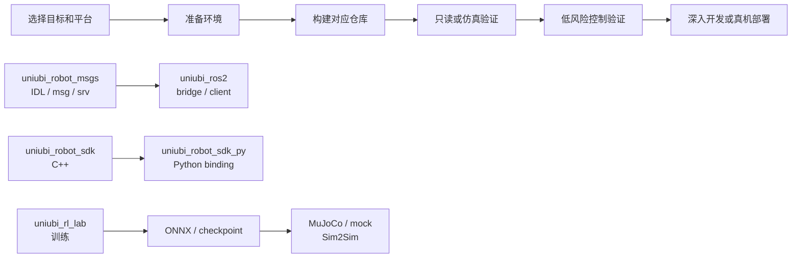

# 从这里开始

这是 Uniubi 开源仓库的默认开发入口。根据开发目标选择对应路径，再进入仓库 README、构建指南和接口文档。

## 先选目标

| 目标 | 首选入口 | 依赖仓库 | 第一个成功标准 |
|---|---|---|---|
| 使用 C++ SDK 控制或读取机器人 | [`uniubi_robot_sdk`](https://github.com/uniubi-ai/uniubi_robot_sdk) | C++ SDK + Linux 运行库 | 示例成功构建，并能完成只读通信验证 |
| 使用 Python SDK | [`uniubi_robot_sdk_py`](https://github.com/uniubi-ai/uniubi_robot_sdk_py) | Python SDK + [`uniubi_robot_sdk`](https://github.com/uniubi-ai/uniubi_robot_sdk) | `pip install` 和 `import robot_motion_sdk` 成功 |
| 编写普通 ROS 2 业务节点 | [`uniubi_ros2`](https://github.com/uniubi-ai/uniubi_ros2) 的 `uniubi_motion_bridge` | [`uniubi_robot_msgs`](https://github.com/uniubi-ai/uniubi_robot_msgs) + `uniubi_ros2` | 能启动 bridge 并读取标准观测 topic |
| 需要自定义 ROS 2 高级控制流程 | [`uniubi_ros2`](https://github.com/uniubi-ai/uniubi_ros2) 的 `uniubi_motion_client` | ROS 2 + `uniubi_robot_msgs` | C++ client 能连接、查询能力并正常退出 |
| 需要原始 DDS / RPC / QoS / 字段 | [DDS / ROS 2 直连接入 API](uniubi_robot_dds_api.md) | `uniubi_robot_msgs` 的 IDL | 能完成发现、只读订阅和请求响应验证 |
| 没有真机，先验证 SDK 链路 | [`uniubi_robot_mock`](https://github.com/uniubi-ai/uniubi_robot_mock) | x86_64 Linux VM + MuJoCo | mock 服务、仿真 bridge 和客户端三端通信成功 |
| 训练 locomotion 策略 | [`uniubi_rl_lab`](https://github.com/uniubi-ai/uniubi_rl_lab) | Isaac Sim / Isaac Lab + GPU | 任务注册、最小训练和 checkpoint 回放成功 |
| 维护消息或协议 | [`uniubi_robot_msgs`](https://github.com/uniubi-ai/uniubi_robot_msgs) | IDL、ROS 2 msg/srv、schema | 接口变更后下游构建和映射检查通过 |

## 总体开发流程

控制类流程必须先完成通信和观测验证；仿真通过不等于真机安全通过。

## 推荐阅读路径

### SDK 路径

1. 阅读 [构建指南](BUILD.md)，先确认 Linux、架构、glibc 和 SDK 运行库要求。
2. 选择 [C++ SDK](https://github.com/uniubi-ai/uniubi_robot_sdk) 或 [Python SDK](https://github.com/uniubi-ai/uniubi_robot_sdk_py)。
3. 先做导入、构建和只读观测验证，再阅读高级、低级或媒体接口手册。
4. 第一次实机动作只使用站立、趴下等低风险动作，并准备人工急停。

C++ 与 Python 必须使用同一套 ABI、架构和版本的运行库；媒体帧订阅只在文档明确支持的平台和部署方式下使用。

### ROS 2 路径

1. 先构建 [`uniubi_robot_msgs`](https://github.com/uniubi-ai/uniubi_robot_msgs)，它提供 ROS 2 接口包 `uniubi`。
2. 再构建 [`uniubi_ros2`](https://github.com/uniubi-ai/uniubi_ros2) 中的 `uniubi_motion_client` 和 `uniubi_motion_bridge`。
3. 普通业务默认使用 Motion bridge；只读场景先读取 `/odom`、`/joint_states`、`/imu/data` 和 `/battery_state`。
4. 只有在 bridge 能力不足时，才进入 `uniubi_motion_client` 或 DDS / ROS 2 协议直连。
5. 控制结束时显式停止动作并释放控制权。

详细选型见 [`uniubi_ros2/docs/ros2_usage_modes.md`](https://github.com/uniubi-ai/uniubi_ros2/blob/main/docs/ros2_usage_modes.md)。

### 训练与仿真路径

1. 在 [`uniubi_rl_lab`](https://github.com/uniubi-ai/uniubi_rl_lab) 完成任务注册、最小训练和 checkpoint 回放。
2. 导出策略后，先用本地 MuJoCo 做不经过 SDK 的 sim2sim 检查。
3. 需要验证 SDK 低级控制链路时，再接入 [`uniubi_robot_mock`](https://github.com/uniubi-ai/uniubi_robot_mock) 做 SDK Sim2Sim。
4. Sim2Real 需要额外核对板端推理格式、SDK ABI、控制周期、关节顺序和安全策略；不能把仿真通过直接视为真机通过。

### 协议和仓库维护路径

1. 消息字段和 wire contract 以 [`uniubi_robot_msgs/idl`](https://github.com/uniubi-ai/uniubi_robot_msgs/tree/main/idl) 为源头。
2. ROS 2 msg/srv 映射和 DDS QoS 规则分别参考 [ROS 2 与 DDS 映射](ros2_dds_interop_overview.md) 和 [DDS / ROS 2 直连接入 API](uniubi_robot_dds_api.md)。
3. 修改接口后，按依赖顺序验证消息包、ROS 2 client/bridge、SDK 映射和示例。

## 仓库边界

| 仓库 | 权责 |
|---|---|
| `uniubi_robot_msgs` | IDL、ROS 2 msg/srv 和 schema 的接口源头 |
| `uniubi_robot_sdk` | C++ 头文件、运行库、CMake 和 C++ 示例 |
| `uniubi_robot_sdk_py` | Python binding、Python 包装层和 Python 示例 |
| `uniubi_ros2` | ROS 2 client、Motion bridge 和 ROS 2 示例 |
| `uniubi_robot_mock` | x86_64 mock runtime、仿真 bridge 和 SDK Sim2Sim |
| `uniubi_rl_lab` | Isaac Lab 训练任务、策略回放和部署入口 |
| `uniubi_examples` | 跨仓示例索引；实际示例代码随所属仓库维护 |
| `uniubi-docs` | 跨仓开发路径、接口手册和协议说明 |

不要在下游仓库复制消息定义；不要把 SDK 动态库、ROS 2 client、mock runtime 和训练环境当作同一个安装包处理。

## 安全边界

首次实机联调按“只读 → 站立/趴下 → 低速运动 → 完整动作”的顺序进行。walking、跳跃、双足、倒立、damp 和低级力矩控制必须在空旷场地、急停可触达、有人值守的条件下验证。

## 下一步文档

- [构建、安装和交叉编译](BUILD.md)
- [C++ 高级控制 SDK](uniubi_high_level_sdk.md)
- [C++ 低级控制 SDK](uniubi_low_level_sdk.md)
- [ROS 2 与 DDS 映射](ros2_dds_interop_overview.md)
