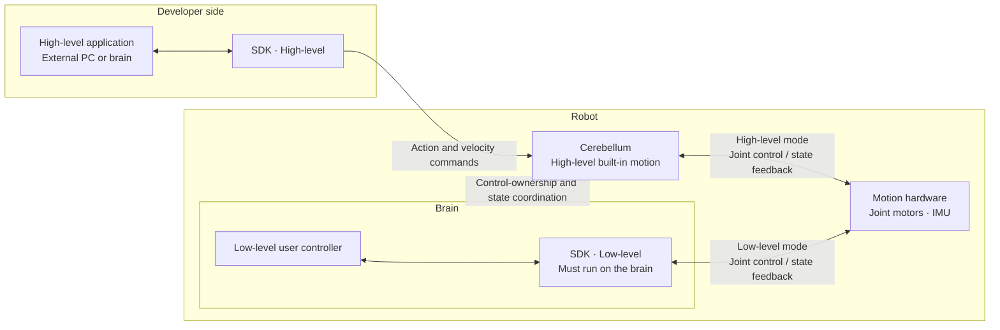
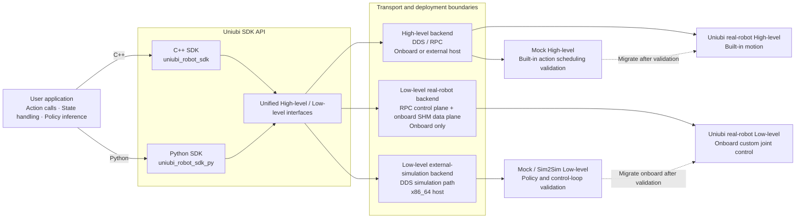

# Core Concepts

**English** | [简体中文](README.zh-CN.md)

This section explains the compute architecture, control abstractions, and system boundaries used in Uniubi robot development: how responsibilities are divided between the brain and cerebellum, what an application controls, where the feedback loop runs, and what responsibilities belong to the SDK, ROS 2 components, and robot services.

Before connecting to a robot, read [Device Network and Robot Compute Module Access](device-network.md) to understand wireless bridging, wired addressing, and exposed ports.

## 1. Brain and Cerebellum

Uniubi robots use a cooperative brain-and-cerebellum architecture:

- The **cerebellum (motion controller)** provides the robot's standard, ready-to-use functions, including core motion control, remote-controller input, UWB, and related device access. It executes these functions in real time so the robot retains its complete baseline capabilities without depending on a user extension.
- The **brain (compute module)** provides substantially more general-purpose compute and serves as the platform for advanced algorithms and custom applications. Developers can deploy perception, planning, decision-making, model inference, and other compute-intensive workloads on the brain, then use robot capabilities through the system interfaces.

The two modules complement each other: the cerebellum executes the standard functions, while the brain extends what the robot can do. Using the brain for extensions does not require an application to bypass or reimplement the built-in motion control, remote-controller, or UWB functions.

### Control paths and deployment locations

High-level and Low-level use the same SDK family, but their deployment locations and hardware-control paths differ on a real robot:



> The real-robot Low-level SDK must run on the robot's brain. It does not support direct hardware control from an external PC.

## 2. Two Control Abstractions

| Dimension | High-level | Low-level |
|---|---|---|
| Application commands | Actions or motion intent | Position or torque targets for individual joints |
| Feedback loop | Robot's built-in motion capability | Application's policy or controller |
| Application responsibilities | Select actions, set parameters, and process state | Read observations, run the policy, and send joint commands at the required rate |
| Typical work | Standing, lying down, walking, turning, and other built-in actions | Custom locomotion policies and joint position or torque control |

### High-level

A High-level application tells the robot what to do. The robot's built-in motion system converts that intent into joint-level execution; the application does not generate commands for every joint.

### Low-level

A Low-level application determines how each joint should be controlled on every cycle. The controller may be a trained policy or a conventional control algorithm. The SDK provides observations, control interfaces, and the real-time communication path, but it does not supply the policy or choose joint targets.

### SDK and Runtime Targets

Both High-level and Low-level applications can reuse the SDK API between Mock / Sim2Sim and a real robot, but API reuse does not mean that the underlying transport or deployment topology is identical. Real-robot Low-level control is onboard only. Low-level SDK use from an external x86_64 host selects the external-simulation backend; it is not a remote real-robot control path.



Passing Mock / Sim2Sim validation does not complete real-robot validation. Recheck the target architecture, ABI, control rate, hardware behavior, emergency stop, and manual takeover on the physical robot. A Low-level policy application must also move to the robot's onboard runtime.

## 3. Control Lifecycle

Real-robot control should follow this lifecycle in either mode:

```text
connect / discover
    ↓
validate read-only observations
    ↓
acquire or enable control
    ↓
continuously send motion intent or joint-control frames
    ↓
stop the action or command stream
    ↓
disable and release control
    ↓
disconnect
```

The continuous-control step differs by mode:

- High-level sends actions or motion intent; the built-in motion system closes the loop.
- Low-level runs the application controller at the agreed rate and sends joint position or torque targets. The application must validate timing, the feedback loop, and shutdown behavior.

See the [API Reference](../api-reference/README.md) for client state machines and lifecycle details.

## 4. Component Responsibilities

| Component | Responsible for | Not responsible for |
|---|---|---|
| Built-in robot motion system | Executing High-level actions and locomotion capabilities | Running an application's custom Low-level policy |
| C++ / Python SDK | High-level and Low-level clients, observations, and control transport | Choosing the application's control mode or training method |
| ROS 2 Motion Bridge | Exposing built-in robot motion capabilities to ROS 2 application nodes | Providing an equivalent joint-level Low-level interface |
| `uniubi_robot_msgs` | Shared ROS 2 interface and schema definitions | Serving as the starting repository for application development or authorizing protocol changes |
| Training and simulation environments | Training, replaying, and evaluating policies | Proving real-robot ABI, timing, and safety behavior |

The SDK, ROS 2 bridge, and message definitions are complementary components, not interchangeable entry points. Choose the control abstraction first, then choose an implementation that supports it.

## 5. From Training to a Real Robot

A Low-level policy normally progresses through these validation stages:

```text
training
  → checkpoint replay
  → local Sim2Sim
  → Mock / SDK Sim2Sim
  → real robot
```

Each stage answers a different question:

- Checkpoint replay verifies that the policy and environment can execute.
- Local Sim2Sim verifies the policy and simulated controller loop.
- Mock / SDK Sim2Sim verifies the SDK client, simulation bridge, and message path.
- Real-robot testing additionally verifies architecture, ABI, control rate, joint order, emergency stop, and manual takeover.

Passing simulation or Mock validation does not prove safe real-robot operation.

## 6. Common Boundaries

- High-level and Low-level are control abstractions, not choices between C++, Python, and ROS 2.
- High-level supports the SDK or ROS 2 Motion Bridge. Joint-level Low-level control uses the SDK.
- Direct DDS/RPC, QoS, and protocol mapping belong to the Advanced integration path; they are not an alternative form of the standard Low-level SDK workflow.
- If an existing field is unclear, read the appropriate How-to guide and API reference before considering any change to `uniubi_robot_msgs/idl`.

## Continue Reading

- [Device Network and Robot Compute Module Access](device-network.md)
- [Quick Start](../../README.md#quick-start)
- [How-to Guides](../how-to/README.md)
- [API Reference](../api-reference/README.md)
- [Advanced](../advanced/README.md)
