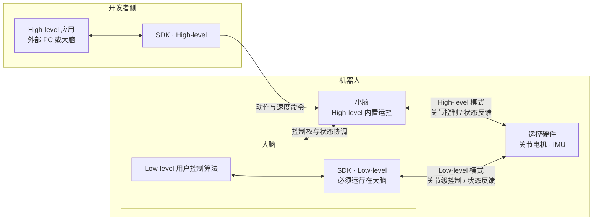
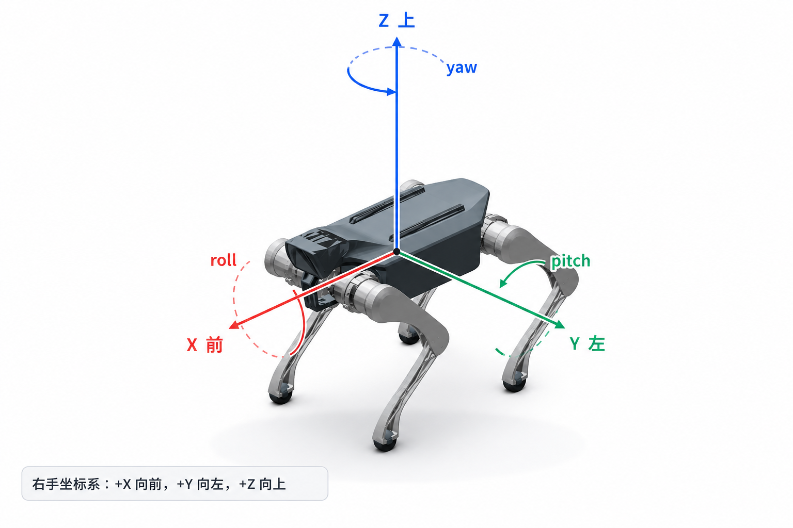
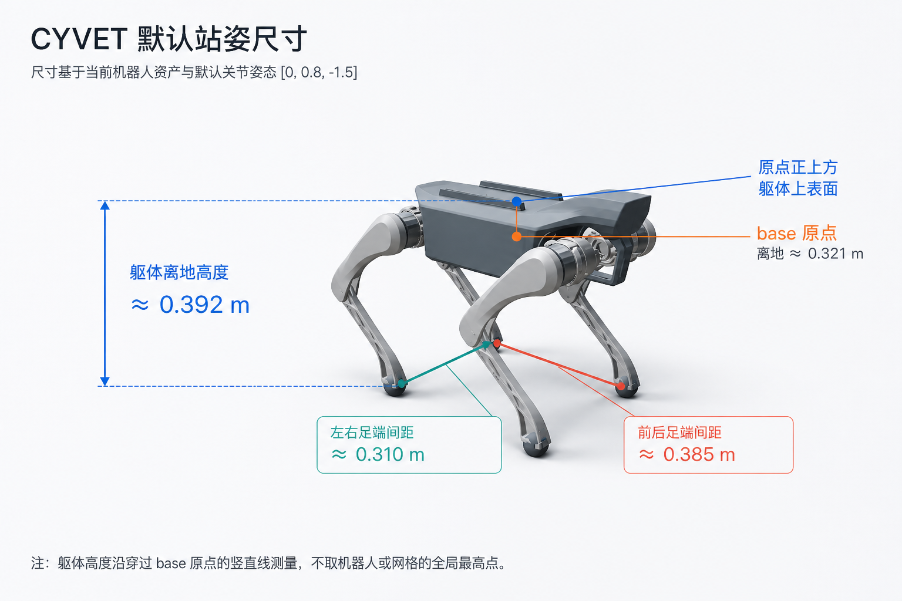
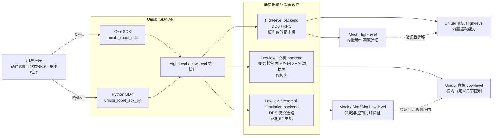

# 核心概念

[English](README.md) | **简体中文**

Core Concepts 解释 Uniubi 机器人开发中的软硬件分工、控制模型和系统边界。它不负责再次选择仓库，而是帮助你理解：大小脑分别负责什么、应用到底控制什么、控制闭环由谁负责，以及 SDK、ROS 2 和机器人服务各自承担什么职责。


## 1. 大脑与小脑

Uniubi 机器狗采用大脑与小脑协同的系统架构：

- **小脑**负责机器人开箱即用的标准基础功能，包括核心运动控制、遥控器指令处理、UWB 及相关设备接入。它承担这些功能的实时执行，让机器人在不依赖用户扩展程序的情况下具备完整的基础能力。
- **大脑**提供更强的通用计算能力，是高级算法和自定义应用的扩展平台。开发者可在大脑上部署感知、规划、决策、模型推理及其他需要较大算力的业务，并通过系统提供的接口使用机器人能力。

两者是分工协作关系：小脑稳定执行标准功能，大脑在此基础上扩展机器人的能力边界。大脑提供扩展能力，并不意味着应用需要绕过小脑重新实现遥控器、UWB 或机器人内置运动控制。

### 控制路径与部署位置

High-level 与 Low-level 使用同一套 SDK 接口，但在真实机器人上的部署位置和硬件控制路径不同：



> 真机 Low-level SDK 必须部署在机器人“大脑”侧运行，不支持从外部 PC 远程直连硬件。

## 2. 机器人网络接入

连接真机前，先从 App 获取 4G、Wi-Fi 和有线 IP 信息。开发机可使用 Wi-Fi IP 或有线 IP 登录设备；需要对外提供的用户服务使用规定的开放端口范围。
机器人内部的“大脑”和“小脑”通过 `eth0.100` 通信。High-level 可运行在外部电脑或机器人“大脑”侧；真机 Low-level SDK 必须运行在“大脑”侧。

[阅读机器人网络接入](device-network.zh-CN.md)

## 3. 机身坐标系与默认站姿

CYVET 采用右手坐标系：+X 向前，+Y 向左，+Z 向上；roll、pitch 和 yaw 的正方向遵循右手定则。



以下尺寸基于当前机器人资产和默认关节姿态 `[0, 0.8, -1.5]`。其中 `0.392 m` 是沿穿过 base 原点的竖直线测得的躯体上表面离地高度，不是机器人或网格的全局最高点。



## 4. 两种控制抽象

| 维度 | High-level | Low-level |
|---|---|---|
| 应用控制对象 | 动作或运动意图 | 每个关节的位置或扭矩目标 |
| 控制闭环 | 由机器人内置动作能力完成 | 由应用自己的策略和控制循环完成 |
| 应用主要负责 | 选择动作、设置参数、处理状态 | 读取观测、运行策略、周期性下发关节控制量 |
| 典型开发内容 | 站立、趴下、行走、转向和已有动作 | 自定义 locomotion 策略、关节位置控制、关节扭矩控制 |

### High-level

High-level 的应用告诉机器人“要做什么”。机器人内部已有的动作能力负责把动作意图转换为具体的运动执行，应用不单独生成每个关节的控制量。

### Low-level

Low-level 的应用自己决定“每个关节下一周期应该怎么控制”。策略可以来自自己的训练流程，也可以是自己实现的控制器；SDK 负责提供观测、控制接口和实时通信链路，但不替应用训练策略或决定关节目标。

### SDK 与运行目标

High-level 和 Low-level 应用都能在 Mock / Sim2Sim 与真实机器人之间复用 SDK API，但“接口复用”不代表底层传输和部署拓扑相同。Low-level 真机只支持板内部署；外部主机上的 Low-level SDK 用于 x86_64 external-simulation backend，不是远程真机控制通道。



Mock / Sim2Sim 验证通过不等于实机验证完成。迁移到真实机器人后，还需重新确认目标架构、ABI、控制周期、硬件行为、急停和人工接管；Low-level 还必须将策略程序部署到机器人板内。

## 5. 控制权和生命周期

无论使用哪种模式，真实机器人控制都应遵循相同的生命周期：

```text
连接 / 发现
    ↓
只读观测验证
    ↓
获取或启用控制权
    ↓
持续发送控制意图或关节控制帧
    ↓
停止动作 / 停止发送
    ↓
禁用并释放控制权
    ↓
断开连接
```

两种模式的关键差异在“持续控制”这一步：

- High-level 发送动作或运动意图，由机器人内置能力完成后续闭环。
- Low-level 必须按约定周期持续运行自己的策略，并发送关节位置或扭矩控制量；控制循环、周期和退出行为都属于应用需要验证的内容。

控制权生命周期的具体 API 和状态机见 [API 参考](../api-reference/README.zh-CN.md)。

## 6. 各层组件的职责

| 组件 | 负责什么 | 不负责什么 |
|---|---|---|
| 机器人内置动作能力 | 执行 High-level 动作和运动能力 | 不替应用运行自定义 Low-level 策略 |
| C++ / Python SDK | 提供 High-level / Low-level 客户端、观测和控制通信接口 | 不替应用选择控制模式或训练策略 |
| ROS 2 Motion Bridge | 将机器人已有运动能力接入 ROS 2 业务节点 | 不提供等价的关节级 Low-level 控制入口 |
| `uniubi_robot_msgs` | 提供 ROS 2 接口和 schema 的统一定义 | 不是普通开发者的起始仓库，也不是修改协议的授权 |
| 训练 / 仿真环境 | 训练、回放和验证策略 | 不代表真实机器人上的 ABI、周期和安全验证已经完成 |

因此，SDK、ROS 2 和消息仓库不是同一层的替代品：先确定控制抽象，再选择能够承载该抽象的实现方式。

## 7. 训练、仿真和真实机器人的关系

Low-level 策略的典型验证链路如下：

```text
训练
  → checkpoint 回放
  → 本地 Sim2Sim
  → [可选：Mock / SDK Sim2Sim]
  → 真实机器人
```

每一步验证的对象不同：

- checkpoint 回放验证策略和接口是否能运行；
- Sim2Sim 验证策略与仿真控制器的闭环行为；
- 可选的 Mock / SDK Sim2Sim 在需要覆盖该集成链路时，验证 SDK client、仿真 bridge 和消息链路；它不是每个策略的必经阶段；
- 真实机器人还必须额外验证架构、ABI、控制周期、关节顺序、急停和人工接管。

仿真或 Mock 通过，不等于真实机器人安全通过。

## 8. 常见边界

- High-level / Low-level 是控制抽象，不是 C++ / Python / ROS 2 的语言选择。
- 选择 High-level 后，可以在 SDK 和 ROS 2 Motion Bridge 之间选择；选择 Low-level 后，关节级控制统一使用 SDK。
- 直接 DDS / RPC、QoS 和协议映射是 Advanced 路径，不是普通 Low-level SDK 的另一种写法。
- 不会使用现有字段时，应先阅读 How-to 和 API Reference，不要直接修改 `uniubi_robot_msgs/idl`。

## 继续阅读

- [快速开始](../../README.zh-CN.md#快速开始)：选择控制模式和实现方式。
- [操作指南](../how-to/README.zh-CN.md)：按任务完成环境准备和最小验证。
- [API 参考](../api-reference/README.zh-CN.md)：查阅接口、字段和生命周期。
- [高级主题](../advanced/README.zh-CN.md)：处理协议、DDS、QoS 和特殊集成场景。
