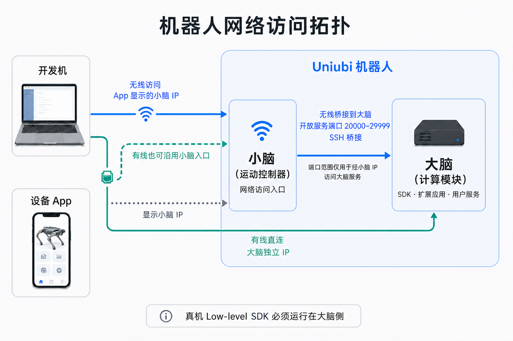

# 设备网络与大脑访问

[English](device-network.md) | **简体中文**

Uniubi 机器狗的小脑负责核心运动控制、遥控器、UWB 等标准功能，大脑提供更强的通用算力并承载扩展应用。两者的完整职责分工见 [大脑与小脑](README.zh-CN.md#1-大脑与小脑)。无线和有线连接下，访问大脑的操作方式基本一致；区别在于有线连接时，大脑还可以拥有独立 IP。

## 网络拓扑

下图只描述开发者需要理解的访问路径，不展开设备内部网络、接口和实现细节：



> 网络可达性不等同于控制部署位置。真机 Low-level SDK 仍必须运行在机器人“大脑”侧。

| 连接方式 | 可使用的地址 | 说明 |
|---|---|---|
| 无线 | App 中显示的小脑 IP | 通过小脑桥接访问大脑 |
| 有线 | App 中显示的小脑 IP，或大脑自己的有线 IP | 访问操作不变；可额外使用大脑的独立 IP |

## 无线连接

大脑本身不提供独立的无线 IP。机器狗通过无线网络连接时，App 中显示的是小脑 IP，外部设备不能通过该地址任意访问大脑的所有端口。

- 需要在大脑上对外提供服务时，使用设备开放的 **20000–29999** 端口范围。
- 不要假设大脑上的其它监听端口能够通过无线网络访问。
- 大脑的 SSH 登录由小脑桥接；如需登录大脑，可使用 App 中显示的小脑 IP 作为 SSH 地址。

具体 SSH 用户、密钥或密码由设备交付配置决定，不应写入公开仓库或示例命令。

## 有线连接

连接有线网络后，大脑可以获得自己独立的有线 IP，为开发机增加一个可直接使用的访问地址。SSH、服务访问等操作方式与无线连接时没有本质区别。

如果不知道大脑的有线 IP，可先使用 App 中显示的小脑 IP，通过 SSH 登录大脑，再在大脑上执行：

```bash
ip -br -4 addr
```

根据实际接入的有线网卡及其 `UP` 状态确认 IPv4 地址。App 中显示的小脑 IP 和大脑的有线 IP 都可作为访问入口，但二者不是同一个地址。

## 开发时如何选择地址

- 通过 App 中显示的小脑 IP 访问大脑服务时，将服务端口配置在设备开放的 `20000–29999` 范围内。
- 有线连接时，可以继续使用原有访问入口，也可以使用大脑的独立 IP；应用层操作方式不需要改变。
- SDK 或 DDS 程序需要显式指定网卡时，应选择当前实际与机器狗通信的接口；网卡名以 `ip -br addr` 的输出为准。
