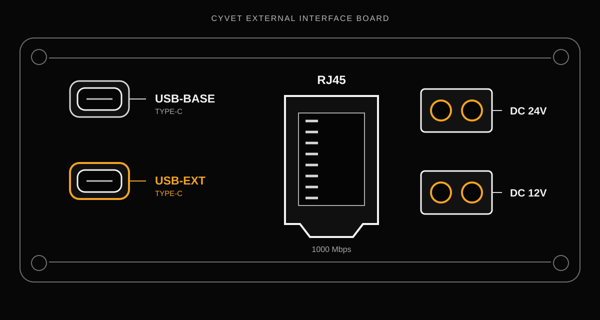
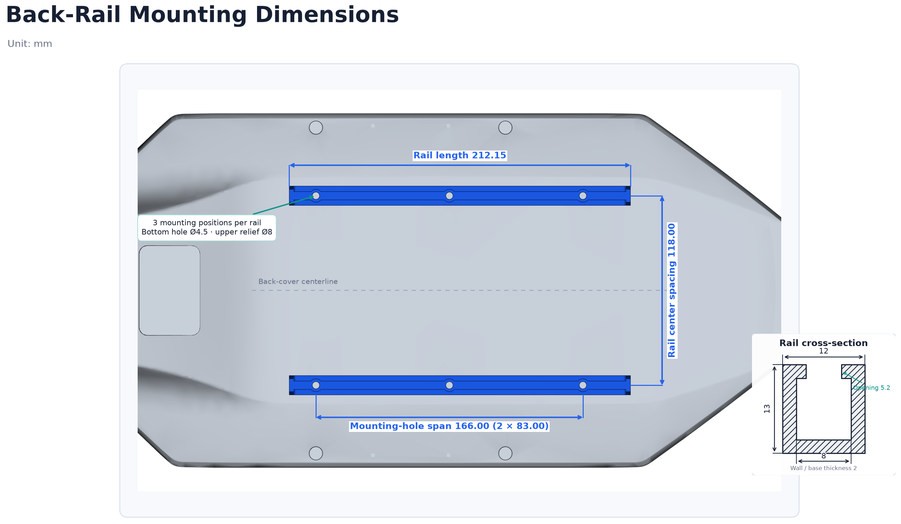

# Connect Peripherals

**English** | [简体中文](connect-peripherals.zh-CN.md)

## Goal

Connect a USB or Ethernet peripheral to the robot compute module (the “brain”), provide power through the external DC outputs when required, and verify the resulting connection.

This guide applies to the Creator version. It describes external peripheral connectivity only; it does not change the control path between the robot brain and motion-control subsystem (the “cerebellum”).

## Interface Boundaries

| Interface | Connected to | Intended use |
|---|---|---|
| `USB-EXT` Type-C | Robot brain | USB cameras, sensors, storage devices, and other supported USB peripherals |
| `USB-BASE` Type-C | Motion-control subsystem | Reserved for the cerebellum; do not use it as a robot-brain peripheral port |
| RJ45 Ethernet | Robot brain | Ethernet cameras, LiDAR units, and other network peripherals |
| DC 12V output | Onboard power system | Standard XT30 power output; total 12V output power must not exceed 36W |
| DC 24V output | Onboard power system | Standard XT30 power output; 24V output power must not exceed 120W |



The diagram follows the actual installed orientation shown in the hardware photo: `USB-BASE` is above `USB-EXT`, RJ45 is to their right, and the two DC power outputs are further to the right.

The two Type-C connectors look similar, but only the connector marked `USB-EXT` is available to applications running on the robot brain. Identify the connector by its PCB silkscreen, not by connector position alone.

## Back-Rail Mounting Dimensions

The robot back cover provides two rails of the same specification for mounting payload brackets or other peripherals. The rails are parallel and use the same cross-section.



The key mechanical dimensions are:

- Each rail is 212.15 mm long, and the rail center spacing is 118.00 mm.
- Each rail provides three mounting positions. Adjacent mounting holes are 83.00 mm apart, and the first-to-last mounting-hole span is 166.00 mm.
- The rail cross-section is 12 mm wide and 13 mm high, with an 8 mm inner channel, a 5.2 mm opening, and 2 mm wall and base thicknesses.
- The bottom mounting hole is 4.5 mm in diameter, with an 8 mm upper relief.

When selecting a slider, nut, or custom bracket, check both the rail opening and the full cross-section. After mounting a payload, recheck the robot center of mass, leg clearance, cable routing, and fastener security.

## 1. Connect a USB Peripheral

1. Power off the peripheral if its installation procedure requires it.
2. Locate the Type-C connector whose PCB silkscreen reads `USB-EXT`.
3. Connect the peripheral to `USB-EXT`. Do not connect it to `USB-BASE`.
4. On the robot brain, inspect USB enumeration:

   ```bash
   lsusb
   ```

5. If the device does not appear, inspect recent kernel messages and verify its cable, power requirement, and Linux driver support:

   ```bash
   dmesg | tail -n 50
   ```

Success means that the expected device appears in USB enumeration and its application-facing device node or driver is available.

## 2. Connect an Ethernet Peripheral

The robot brain does not currently run a DHCP server on the external Ethernet connection. Connecting a cable therefore does not automatically assign an IP address to the peripheral.

Before testing connectivity:

1. Determine the peripheral's configured IP address and subnet prefix.
2. Identify the robot-brain network interface connected to the RJ45 port:

   ```bash
   ip -br link
   ip -br addr
   ```

3. Configure a static IP address for the robot-brain interface in the same subnet as the peripheral.
4. Ensure that the two addresses are different and do not conflict with another device.
5. If the peripheral address is configurable, configure both endpoints consistently. Follow the network-management method supplied with the delivered system when making the robot-brain configuration persistent.
6. Verify reachability:

   ```bash
   ping -c 3 <peripheral-ip>
   ```

Do not copy an interface name or IP address from another robot without checking the current device. Network-interface names and delivered network settings may differ.

Success means that the robot brain has an address in the peripheral's subnet and can reach the peripheral's IP address without an address conflict.

## 3. Power an External Peripheral

The DC 12V and DC 24V connectors are power outputs for external equipment. They do not carry USB or Ethernet data.

Before connecting a peripheral:

1. Confirm the peripheral's rated input voltage, power requirement, connector, and polarity.
2. Select the output whose voltage matches the peripheral.
3. Include startup and peak power when checking the power budget.
4. Keep total 12V output power at or below 36W and 24V output power at or below 120W.
5. Establish the USB or Ethernet data connection separately when the peripheral also exchanges data with the robot brain.

Do not connect a device to an output voltage that does not match its rated input. Identify the power outputs by the PCB silkscreen and the delivered hardware documentation before wiring.

## 4. Troubleshooting

### The USB peripheral is not visible on the robot brain

- Confirm that the cable is connected to `USB-EXT`, not `USB-BASE`.
- Check whether the peripheral requires separate power.
- Check USB enumeration, kernel messages, and driver support.

### Ethernet link is present but the peripheral is unreachable

- Confirm that both endpoints use static IP addresses in the same subnet.
- Confirm that the addresses are different.
- Recheck the selected robot-brain network interface.
- Check the peripheral's subnet mask, service port, firewall, and service listening address.

### The peripheral is reachable but the application cannot open it

Network or USB reachability proves only the transport path. Continue by checking device permissions, the required driver or runtime library, and application-specific configuration.

### The peripheral has a data connection but does not power on

- Confirm that the selected output voltage matches the peripheral.
- Confirm the connector and polarity.
- Check both continuous and startup power requirements against the output limit.
- Remember that a USB or Ethernet data connection does not imply that the separate DC power connection is correct.

## Next Steps

- For robot login addresses and externally accessible service ports, see [Robot Network Access](../core-concepts/device-network.md).
- For camera-frame access through the Uniubi SDK, see the [Media API](../api-reference/README.md).
- For a ROS 2 application, continue with [Start and Validate Motion Bridge](ros2-motion-bridge.md) or the relevant device driver.
