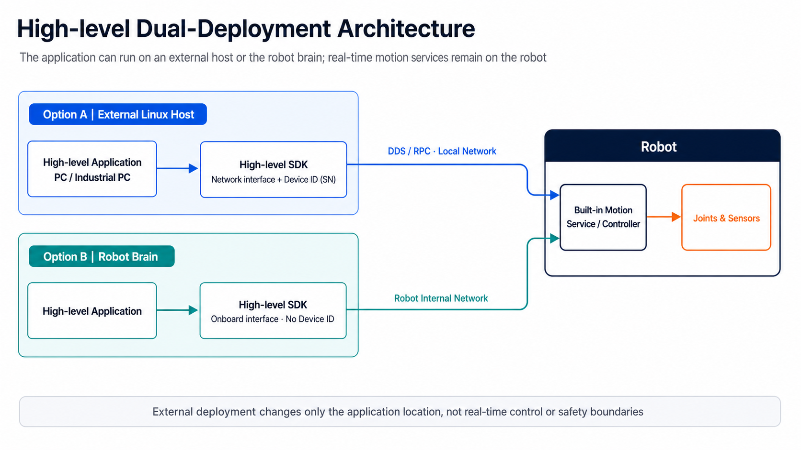

# High-level: Use Built-in Robot Actions

**English** | [简体中文](high-level-control.zh-CN.md)

## Goal

Use motion and locomotion capabilities already provided by the robot. The application sends actions or motion intent and does not generate position, velocity, or torque commands for individual joints.

Typical goals include:

- making the robot stand, lie down, or perform another built-in action;
- using built-in walking, steering, and speed control; and
- writing a ROS 2 application node that invokes robot motion capabilities.

## Common High-level Actions

Available actions can vary by product model and software version. The table below uses the current
`motionCapacity` as a reference for common actions. Always treat the runtime capability query as authoritative
for supported actions, parameter fields, ranges, and units: call `getMotionCapabilities()` in C++,
`get_motion_capabilities()` in Python, or `/motion/query_capabilities` in ROS 2.

Send `startAction()` / `start_action()` once; do not periodically resend the request. Use a state query to
confirm whether the action has started or completed. A successful RPC return alone does not confirm either.

In the speed ranges below, `vx` means `lineVelocityX` (m/s), `vy` means `lineVelocityY` (m/s), and `wz`
means `velocity` (rad/s). “None” means that no speed command should be passed when invoking the action.

| Action category | Name | Action key | Speed command range | Description |
|---|---|---|---|---|
| Basic posture | Lie down | `laying` | None | Move the robot into a stable lying posture. |
| Basic posture | Stand | `standing` | None | Move the robot into a stable standing posture. |
| Locomotion | Walk | `walking` | Slow: `vx [-1.5, 1.5]`, `vy [-1, 1]`, `wz [-3, 3]`; fast: `vx [-2.5, 3]`, `vy [-1, 1]`, `wz [-3, 3]` | Control forward, lateral, and turning motion; the slow profile is the default. |
| Locomotion | Step in place | `tweak` | `vx/vy [-0.2, 0.2]`, `wz [-0.5, 0.5]` | Step in place or perform a low-speed adjustment. |
| Special posture | Biped stand | `bipedStand` | `vx/vy [-0.3, 0.3]`, `wz [-1.5, 1.5]` | Balance on the rear legs in a biped posture. |
| Special posture | Handstand | `handstand` | `vx/vy [-0.3, 0.3]`, `wz [-1.5, 1.5]` | Balance on the front legs in a handstand posture. |
| Special posture | Left-side stand | `leftSideStand` | `vx/vy [-0.3, 0.3]`, `wz [-1.5, 1.5]` | Enter a side-standing posture supported on the left side. |
| Special posture | Right-side stand | `rightSideStand` | `vx/vy [-0.3, 0.3]`, `wz [-1.5, 1.5]` | Enter a side-standing posture supported on the right side. |
| Interactive motion | Body wave | `waveBody` | `vx [-0.06, 0.05]`, `vy [-0.23, 0.23]`, `wz [-0.35, 0.35]` | Perform a body-waving demonstration motion. |
| Interactive motion | Wave | `waveHand` | None | Raise a leg and perform a waving demonstration motion. |
| Interactive motion | Heart gesture | `heartSit` | None | Sit and perform a heart-shaped gesture. |
| Jump | Forward jump | `jumpForward` | None | Perform one forward jump. |
| Jump | Front flip | `jumpFrontflip` | None | Perform one front flip. |
| Jump | Side flip | `jumpSideflip` | None | Perform one side flip. |
| Jump | Left-side flip | `jumpLeftSideflip` | None | Perform one left-side flip. |
| Jump | Backflip | `jumpBackflip` | None | Perform one backflip. |
| Jump | Double backflip | `jumpDoubleBackflip` | None | Perform one double backflip. |
| Jump | Double side flip | `jumpDoubleSideflip` | None | Perform one double side flip. |
| Jump | Double left-side flip | `jumpDoubleLeftSideflip` | None | Perform one double left-side flip. |
| Safety | Emergency stop | `emergencyStop` | None | Request that the robot enter the emergency-stop sequence immediately. |

## Choose Where the Application Runs

High-level real-robot applications support two deployment modes. In both modes, the built-in motion service continues to run on the robot; only the application and SDK client location changes.

| Deployment mode | Application location | Network and target selection |
|---|---|---|
| External host | Linux PC or industrial computer | Select the host interface that is actually connected to the robot network, then create the client with the target device ID (SN). Obtain the SN from the Basic Information page in the Uniubi App or SDK discovery. |
| Onboard | Robot compute module (“brain”) | No device ID is required; use the onboard single-device client overload. |

For external-host discovery, follow this order:

1. Register the discovery callback and set the robot-facing network interface.
2. Initialize the SDK service.
3. Start discovery. A `true` return only means that the request was issued; device responses arrive asynchronously through the callback.
4. If no callback arrives within 5 seconds, retry discovery after checking the interface and robot status.
5. Deduplicate responses by SN and require the application or operator to choose the intended robot. Do not silently select the first response. If the robot IP is known, compare it with `network.ether.ipv4Addr`, `network.wlan.ipv4Addr`, `network.hotspot.ipv4Addr`, and `network.mobile.ipv4Addr` in the callback `info` to identify the corresponding SN.

The IP provides reachability and filters discovery results. The High-level client still receives the Device ID (SN); never pass an IP address as `device_id`.

Low-level control on real hardware is different: the joint-control application still runs onboard. See the Low-level guide for that deployment boundary.

## Out of Scope

If your application runs its own policy and directly outputs joint position or torque targets, follow [Low-level: Run a Custom Joint-control Policy](low-level-control.md).

## Choose an Implementation

| Development path | Entry point | Use when |
|---|---|---|
| C++ / Python SDK | `MotionHighLevelClient` | Developing a control or observation application directly against the SDK |
| ROS 2 | `uniubi_motion_bridge` | Developing a ROS 2 application with standard topics and services |

For SDK development, first complete [SDK First Use](sdk-first-use.md). For ROS 2, follow [Start and Validate ROS 2 Motion Bridge](ros2-motion-bridge.md).

## Repositories

- C++ SDK: [`uniubi_robot_sdk`](https://github.com/uniubi-ai/uniubi_robot_sdk)
- Python SDK: [`uniubi_robot_sdk_py`](https://github.com/uniubi-ai/uniubi_robot_sdk_py)
- ROS 2 interfaces and bridge: [`uniubi_robot_msgs`](https://github.com/uniubi-ai/uniubi_robot_msgs) → [`uniubi_ros2`](https://github.com/uniubi-ai/uniubi_ros2)

`uniubi_robot_msgs` is the authoritative source for ROS 2 interfaces and build dependencies. It is not the normal place for application-specific changes.

## Before Real-robot Control: Disconnect the Remote Controller

Before requesting High-level control, either power off the remote controller, or press and hold its `M` button until the robot announces “遥控器连接已断开” (remote controller disconnected). High-level cannot obtain ownership while the remote controller remains connected. Read-only checks do not require this step.

In an emergency during High-level control, press `M` again and wait until the robot announces “遥控器已连接” (remote controller connected). Only then use the remote controller to take over.

_This figure is only for locating the controller buttons. Follow the disconnect prerequisite above for High-level ownership._

## Minimum Success Criteria

1. Build or import the SDK, or build the ROS 2 bridge.
2. Complete read-only observation checks before requesting control.
3. Before triggering any action other than `laying`, start `walking` with all three velocities set to zero and use the state query to confirm that the effective action is `walking`; only then trigger the target action. `laying` does not require this preliminary transition.
4. With the emergency stop reachable and an operator ready to intervene, validate low-risk actions such as standing and lying down before low-speed locomotion.

See the High-level [Python API](../api-reference/python/high-level.md), [C++ API](../api-reference/cpp/high-level.md), and [ROS 2 Motion Bridge guide](ros2-motion-bridge.md) for lifecycle and safety details.

The external-host High-level C++ SDK, Python SDK, and ROS 2 paths have all been validated on a real robot. Each path must select the network interface that actually reaches the robot and pass the target Device ID (SN).
