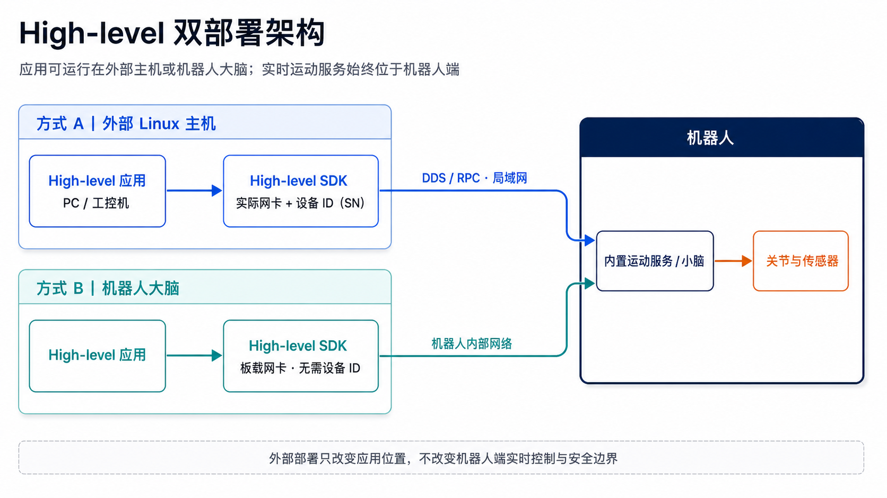
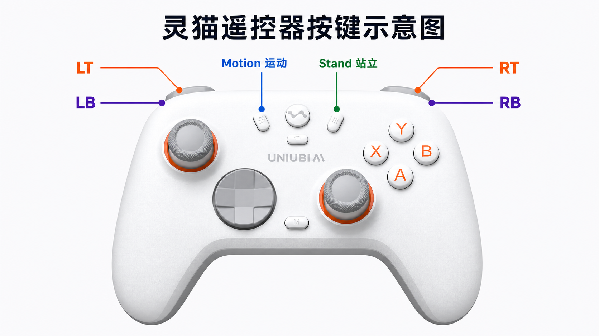

# High-level：使用机器人内置动作

[English](high-level-control.md) | **简体中文**

## 目标

使用机器人已经提供的动作和运动能力。应用表达的是动作或运动意图，不单独生成每个关节的位置、速度或扭矩控制量。

典型目标包括：

- 让机器人站立、趴下或执行已有动作；
- 使用机器人已有的行走、转向和速度控制能力；
- 在 ROS 2 中编写调用机器人运动能力的业务节点。

## 先选择应用部署位置

High-level 真机应用支持两种部署模式。两种模式下，内置运动服务都继续运行在机器人端；变化的只是业务应用与 SDK 客户端的位置。

| 部署模式 | 应用位置 | 网络与目标选择 |
|---|---|---|
| 外部主机 | Linux PC 或工控机 | 选择实际连接机器人网络的主机网卡，再用目标设备 ID（SN）创建客户端。SN 可在 Uniubi App 的“基础信息”页面查看，也可通过 SDK discovery 获取。 |
| 板内 | 机器人大脑 | 不需要设备 ID，使用板内单设备客户端重载。 |

外部主机使用 discovery 时，按以下顺序执行：

1. 先注册发现回调，并设置实际连接机器人网络的网卡。
2. 再初始化 SDK service。
3. 发起发现。`true` 只表示请求已发出；设备响应通过回调异步到达。
4. 5 秒内没有任何回调时，检查网卡和机器人状态后重试发现。
5. 按 SN 去重，并由应用或操作员明确选择目标机器人；不要静默自动选择第一台。若已知机器人 IP，可将它与回调 `info` 中 `network.ether.ipv4Addr`、`network.wlan.ipv4Addr`、`network.hotspot.ipv4Addr`、`network.mobile.ipv4Addr` 比对，筛出对应 SN。

IP 只用于网络可达性和筛选发现结果；创建 High-level 客户端时仍传入设备 ID（SN），不能把 IP 当作 `device_id`。

Low-level 真机的部署边界不同：关节控制应用仍运行在板内。具体见 Low-level 文档。

## 这条路径不解决什么问题

如果你要自己训练或运行控制策略，并直接输出每个关节的位置或扭矩，请转到 [Low-level：自定义关节控制策略](low-level-control.zh-CN.md)。

## 选择实现方式

| 开发方式 | 入口 | 适合场景 |
|---|---|---|
| C++ / Python SDK | `MotionHighLevelClient` | 直接使用 SDK 开发控制或观测程序 |
| ROS 2 | `uniubi_motion_bridge` | 编写普通 ROS 2 业务节点，使用标准 topic/service |

如果使用 SDK，先完成 [SDK 通用准备](sdk-first-use.zh-CN.md)。如果使用 ROS 2，直接进入 [启动并验证 Motion bridge](ros2-motion-bridge.zh-CN.md)。

## 对应仓库

- C++ SDK：[`uniubi_robot_sdk`](https://github.com/uniubi-ai/uniubi_robot_sdk)
- Python SDK：[`uniubi_robot_sdk_py`](https://github.com/uniubi-ai/uniubi_robot_sdk_py)
- ROS 2 接口和 bridge：[`uniubi_robot_msgs`](https://github.com/uniubi-ai/uniubi_robot_msgs) → [`uniubi_ros2`](https://github.com/uniubi-ai/uniubi_ros2)

`uniubi_robot_msgs` 是 ROS 2 构建依赖和接口来源，不是普通业务开发的修改入口。

## 真机取权前：先断开遥控器

申请 High-level 控制权前，关闭遥控器，或长按遥控器 `M` 键切换，直到听到“遥控器连接已断开”
的语音提示。遥控器仍连接时，High-level 无法取得控制权；只读检查不要求断开遥控器。

_此图只用于定位遥控器按键；High-level 取权以本节文字说明的断连前置条件为准。_

## 最小成功标准

1. 完成 SDK 构建/导入，或完成 ROS 2 bridge 构建。
2. 先完成只读观测验证。
3. 触发 `laying` 以外的动作前，先启动三轴速度均为 0 的 `walking`，并通过状态查询确认
   实际动作已经进入 `walking`，再触发目标动作。`laying` 不要求这一步前置切换。
4. 在具备急停和人工接管条件后，再执行站立、趴下或低速运动等低风险动作。

High-level 控制流程和安全边界见 [Python API](../api-reference/python/high-level.zh-CN.md)、[C++ API](../api-reference/cpp/high-level.zh-CN.md) 及 [ROS 2 Motion bridge 导读](ros2-motion-bridge.zh-CN.md)。

外部主机 High-level C++ SDK、Python SDK 和 ROS 2 路径均已完成真机验证；使用时都必须选择实际连接机器人网络的网卡，并传入目标设备 ID（SN）。
